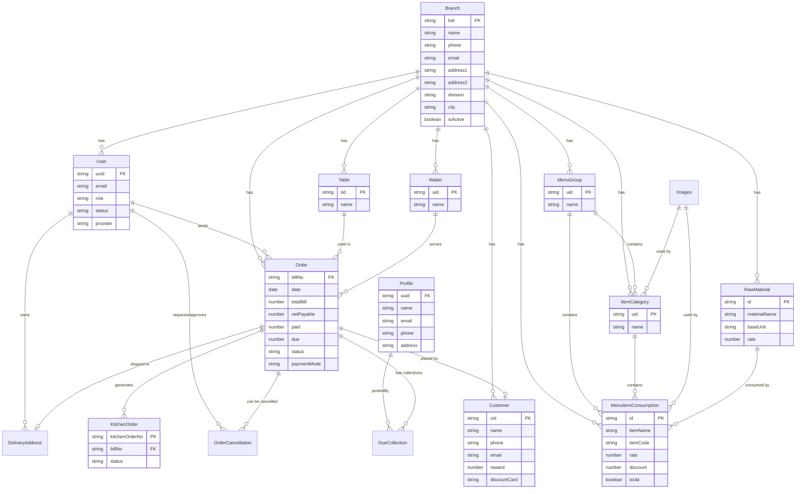

# Database Entity Relationship Diagram (ERD)

This document contains the ER diagram for the Restaurant Management System (RMS) database, represented using Mermaid syntax.

## Summary of Relationships

- **Branch-Centric Architecture**: Most entities are linked to a `Branch`, supporting multi-location management.
- **Order Flow**: `Orders` are linked to `Tables`, `Waiters`, and `Customers`. They generate `KitchenOrders` and can have `OrderCancellations` or `DueCollections`.
- **Menu & Inventory**: `MenuItemConsumption` represents prepared dishes, which reference `RawMaterials` (inventory items).
- **User & Profile**: Authentication (`User`) is decoupled from personal details (`Profile`), linked via `uuid`.

## Detailed Database Relations

### Branch Relationships (One-to-Many)
- **Branch -> User**: One branch can have multiple users assigned to it.
- **Branch -> Customer**: Customers are registered under specific branches.
- **Branch -> MenuGroup**: Menu groups are defined per branch.
- **Branch -> ItemCategory**: Item categories are linked to a branch.
- **Branch -> Table**: Physical tables belong to a specific branch.
- **Branch -> Waiter**: Waitstaff are assigned to branches.
- **Branch -> Order**: All sales orders are tracked by branch.
- **Branch -> RawMaterial**: Inventory/Raw materials are branch-specific.
- **Branch -> MenuItemConsumption**: Menu items are available across one or more branches.

### User & Authentication
- **User -> DeliveryAddress (1:N)**: A user can save multiple delivery addresses.
- **User -> Order (1:N)**: Tracks which user (staff) posted/created an order.
- **User -> OrderCancellation (1:N)**: Tracks who requested and who approved a cancellation.
- **User <-> Profile (1:1)**: Linked via `uuid`. `User` handles credentials, `Profile` handles personal info.

### Menu Structure
- **MenuGroup -> ItemCategory (1:N)**: Categories (e.g., "Cold Drinks") belong to a Menu Group (e.g., "Beverages").
- **MenuGroup -> MenuItemConsumption (1:N)**: Menu items are grouped under Menu Groups.
- **ItemCategory -> MenuItemConsumption (1:N)**: Menu items are categorized for easier filtering.
- **Images -> ItemCategory/MenuItemConsumption (1:N)**: Images are referenced by categories and items.

### Order Operations
- **Order -> KitchenOrder (1:N)**: An order can generate multiple KOTs (Kitchen Order Tickets).
- **Order -> OrderCancellation (1:1/N)**: An order may have a cancellation request.
- **Order -> DueCollection (1:N)**: Tracks multiple payments/collections against a single due order.
- **Order -> Table (N:1)**: Many orders can be served at one table (over time).
- **Order -> Waiter (N:1)**: Many orders can be served by the same waiter.
- **Order -> Customer (N:1)**: A customer can place many orders.
- **Order -> DeliveryAddress (N:1)**: Many orders can be delivered to the same saved address.

### Inventory & Production
- **RawMaterial -> MenuItemConsumption (N:M)**: Raw materials are consumed by many menu items, and one menu item can consume many raw materials (tracked via the `consumptions` array).
